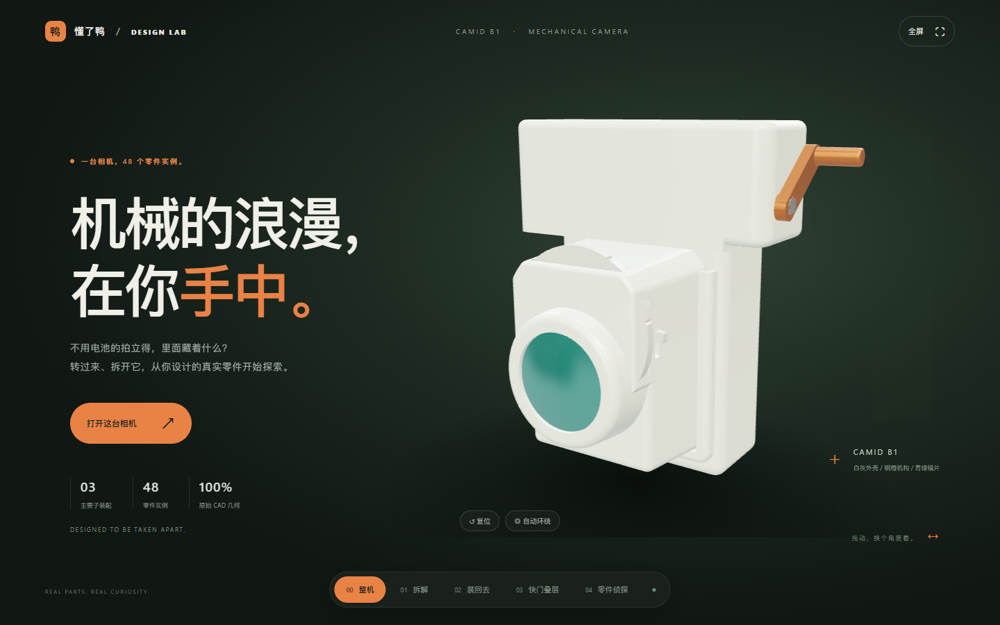

# CAMID B1 · 机械成像实验室

CAMID B1 是一台基于真实装配结构设计的纯机械拍立得。本项目把它转化为一个适合“懂了鸭”青少儿 AI 科普平台的全屏互动 HTML：孩子可以查看真实 CAD 总装配、逐步装回 Printer、观察三片快门，再用零件分类挑战检验自己的理解。

页面运行时不依赖在线资源。Three.js、应用脚本和 CAD 模型都在本地，适合独立运行和打包；修改源码时需要安装构建依赖。

## 快速运行

直接双击 `index.html` 即可打开，GLB 已内嵌在本地脚本中。也可以使用静态服务器：

```powershell
python -m http.server 4173
```

然后访问 <http://127.0.0.1:4173/>。

## 互动内容

- **整机**：直接查看真实 CAD 总装配，拖动旋转、缩放和自动环绕。
- **拆解**：按 `Printer`、`Shutter`、`Tank` 分组浏览真实零件，搜索、选中、单独观察并展开装配。
- **装回去**：依据 A4-5/A4-6 Printer 装配说明逐步显示支承件、方辊、三类齿轮、圆辊、出口件、锁件、外壳和曲柄。
- **快门叠层**：分开观察 CAD 中的 `Shutter 1/2/3`，对应 A4-8/A4-9 的叠层顺序；不把叠层动画冒充真实曝光时序。
- **零件侦探**：用真实 CAD 零件肖像判断它属于 Printer、Shutter 还是 Tank。

## 设计方向

视觉语言来自 CAMID B1 的产品渲染与网页参考：

- 哑光白 / 浅灰外壳
- 炭黑背景与内部机构
- 铜色、橙色作为机械焦点
- 青绿色镜片高光
- 黑色胶囊导航和大字号几何标题
- 深蓝、酒红与冷蓝雾光作为章节氛围

页面使用不同的内容载体来避免“每章都是模型加文字”：实时 CAD 总装配、零件目录、装配进度条、快门叠层观察器和零件分类挑战分别承担不同的知识目标。

## 结构证据边界

STEP 文件确认了产品节点和父子装配关系，包括：

- 根装配 `Camera V3`
- `Printer - FullAssembly`
- `Shutter`
- `Tank`
- `CrankHandle`、`CrankShaft`
- `Roller`、`CubicRoller`、`FilmExit`
- `RollerGear`、`CubeRollerGearS`、`CubicRollerGearL`
- `Shutter1/2/3`、`Trigger`、`Wheel^Shutter`、`Glass`
- `Lever`、`Trap`、`Film dimensions`

STEP 保留了零件几何与静态装配位置，没有提供 SolidWorks mates、运动限位或摩擦接触约束。当前页面的爆炸展开、逐步显示和快门分层用于结构观察；传动方向、比例、送片路径和曝光时序尚未验证。

详细的结构判断、推测和待补资料见 [`docs/structure-research.md`](docs/structure-research.md)。视觉与交互设计说明见 [`docs/design.md`](docs/design.md)。

### 展示排除项

源 STEP 中存在节点 `2113 - Printer - Big gear`，设计确认它是误隐藏的辅助零件，不属于最终产品展示。源 STEP 未被改写；派生 GLB 在转换时按完整路径排除了该节点，并在 `assets/camera-v3.manifest.json` 的 `excludedPaths` / `omittedParts` 中保留了可追溯记录。

## 页面截图




## 产品视觉参考

以下图片来自本项目 `Rendering` 目录，用于记录产品和交互的视觉方向；可运行的互动页面本身位于仓库根目录的 `index.html`。


## 文件结构

```text
index.html                  独立运行的互动页面
assets/                     GLB、内嵌模型、应用脚本与本地图片
src/app.js                  Three.js 交互源码
scripts/build.mjs           打包脚本
scripts/convert_step.py     保留装配层级的 STEP 转换脚本
screenshots/                实际页面截图与产品参考图
docs/design.md              设计系统与交互说明
docs/structure-research.md  CAD 结构证据边界
```

## 后续方向

1. 根据几何和工程图核对齿数、轴向约束和片材间隙。
2. 获取 SolidWorks mates 或实机录制，验证传动、快门时序和片材路径。
3. 将每个章节拆成懂了鸭平台可独立加载的内容单元。

## 修改与构建

```powershell
pnpm install
pnpm run build
```

构建脚本将 `src/app.js` 打包至 `assets/app.js`，并根据 `assets/camera-v3.glb` 生成 `assets/model-data.js`。预构建文件已包含在仓库中。
